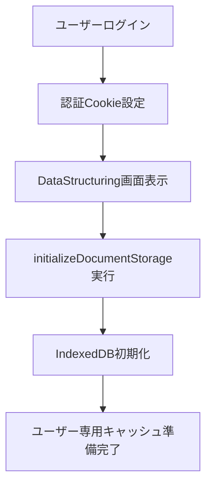
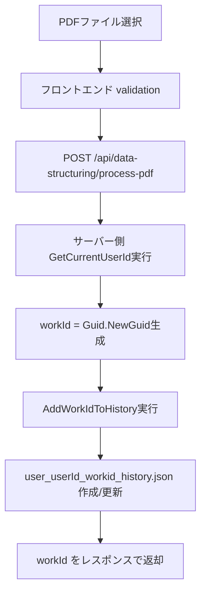
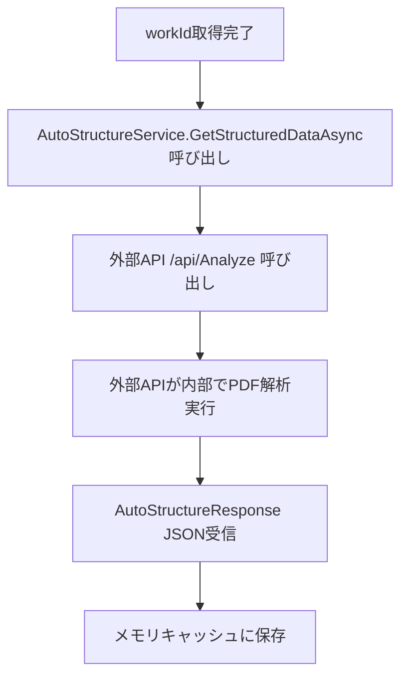
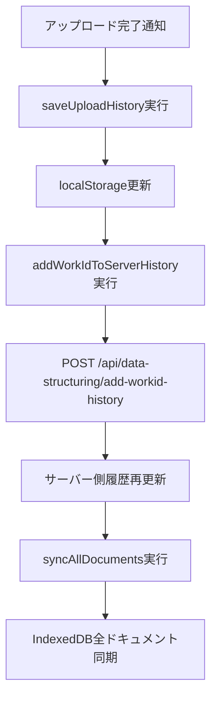
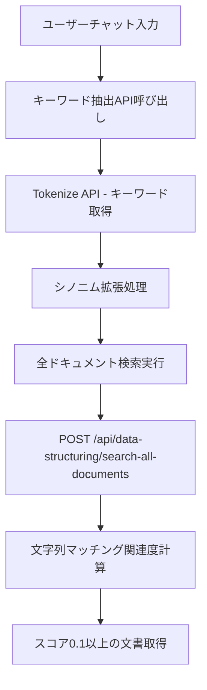
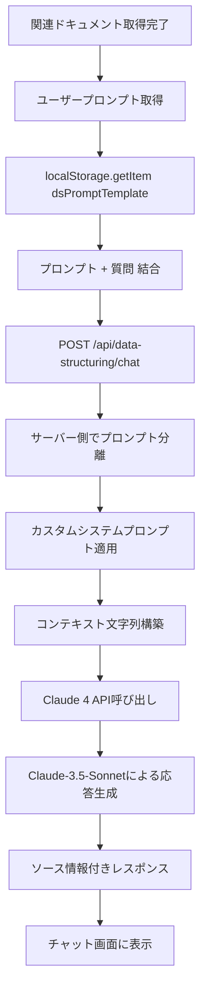
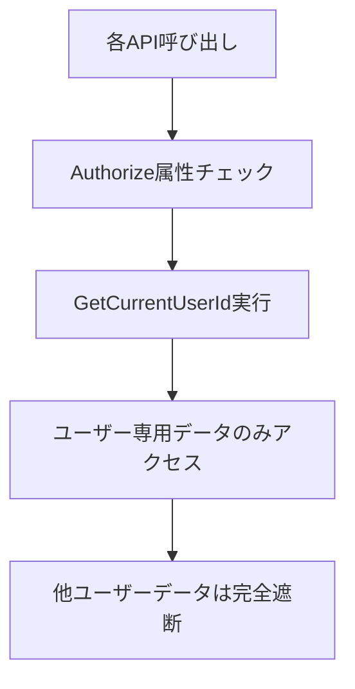
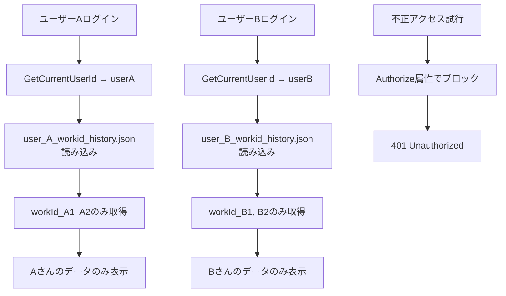
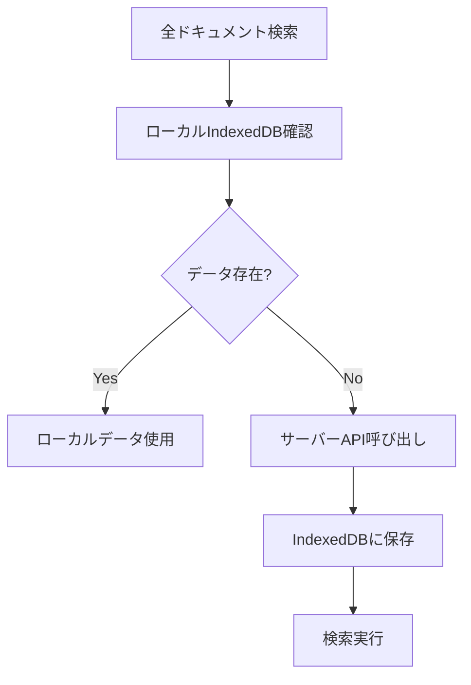

# ILUデータ構造化ソリューション - 完全処理フロー説明

## 📋 システム概要

本システムは、PDFドキュメントのアップロードから、AI搭載のRAG（Retrieval-Augmented Generation）チャット応答までを一貫して処理するWebアプリケーションです。ユーザー認証ベースの完全なデータ分離と、高性能なキャッシュシステムを備えています。

## 🔄 完全処理フロー

### Phase 1: ユーザー認証・初期化



**詳細ステップ:**
1. **ユーザーログイン** → `Login.cshtml.cs`で認証処理
2. **認証Cookie設定** → `ILUSolution.Auth` Cookie作成
3. **画面初期化** → `DataStructuring.cshtml`読み込み
4. **IndexedDB初期化** → `DocumentStorageManager`インスタンス作成
5. **キャッシュ準備** → 50MB容量制限、1000ドキュメント上限設定

**関連ファイル:**
- `Pages/Login.cshtml.cs` - 認証処理
- `Pages/DataStructuring.cshtml` - メイン画面
- `wwwroot/js/document-storage.js` - IndexedDBキャッシュ管理

---

### Phase 2: PDFアップロード・workId生成



**詳細ステップ:**
1. **ファイル選択** → `<input type="file" accept=".pdf">`
2. **バリデーション** → PDFファイル形式チェック
3. **アップロードAPI** → `ProcessPdf(IFormFile file)`実行
4. **ユーザーID取得** → `User?.Identity?.Name` または IPベースフォールバック
5. **workId生成** → `Guid.NewGuid().ToString("N")`
6. **履歴追加** → `storage/user_{userId}_workid_history.json`に保存
7. **レスポンス** → `{ success: true, work_id: workId }`

**セキュリティ要素:**
- ✅ **ユーザー認証必須** → `[Authorize]`属性による認証チェック
- ✅ **ユーザー専用履歴** → `user_{userId}_workid_history.json`で完全分離
- ✅ **workId所有権確認** → アップロード時点でユーザー-workId紐付け

**関連ファイル:**
- `Controllers/DataStructuringController.cs` - アップロード処理
- `wwwroot/js/data-structuring.js` - フロントエンド処理

---

### Phase 3: 外部API解析・データ構造化



**詳細ステップ:**
1. **workId取得完了** → フロントエンドからworkIdを受信
2. **外部API呼び出し** → `AutoStructureService.GetStructuredDataAsync(workId)`実行
3. **外部APIが解析処理** → `http://10.24.152.66:9926/api/Analyze`が内部で以下を実行：
   - PDF → 画像変換
   - OCR処理 → テキスト抽出  
   - チャンク分割・構造化
   - シノニム生成
4. **JSON受信** → `AutoStructureResponse`オブジェクトとして受信
5. **キャッシュ保存** → `_dataCache[workId]`に2時間期限で保存

**外部API処理内容:**
- PDF → 画像変換（PNG形式）
- Azure OCR → テキスト抽出
- 意味単位でのチャンク分割
- 自動シノニム生成
- 構造化データ（JSON）作成

**関連ファイル:**
- `Services/AutoStructureService.cs` - 外部API呼び出し
- `Controllers/DataStructuringController.cs` - キャッシュ管理

---

### Phase 4: フロントエンド履歴管理・同期



**詳細ステップ:**
1. **ローカル履歴保存** → `localStorage.setItem('uploadHistory', ...)`
2. **サーバー履歴更新** → 二重確実性のため再度サーバーに送信
3. **全ドキュメント同期** → `GetAllDocuments()`でユーザー専用workIdリスト取得
4. **IndexedDB保存** → 各workIdのデータをローカルDBに保存
5. **LRU管理** → 容量超過時は最近最少使用データを削除

**キャッシュ仕様:**
- **容量制限:** 50MB
- **ドキュメント上限:** 1000件
- **LRU削除:** 最近最少使用データを自動削除
- **自動同期:** 24時間ごとの更新チェック

**関連ファイル:**
- `wwwroot/js/data-structuring.js` - 履歴管理
- `wwwroot/js/document-storage.js` - IndexedDBキャッシュ

---

### Phase 5: RAGチャット質問処理



**詳細ステップ:**
1. **質問入力** → チャットボックスにメッセージ入力
2. **キーワード抽出** → `http://10.24.152.66:9926/api/Tokenize`API呼び出し
3. **シノニム拡張** → 抽出キーワードに対する類義語検索
4. **全ドキュメント検索** → ユーザーの全workIdから関連文書検索
5. **関連度計算** → `CalculateRelevanceScore()`でスコア算出
6. **結果フィルタリング** → スコア0.1以上の文書のみ選択

## 🧮 **検索スコア計算システム**

本システムは **多層的なスコア計算アルゴリズム** を採用し、複数の手法を組み合わせて最適な検索結果を提供します。

### **1. Azure Search ネイティブスコア**
```csharp
// Azure Searchから直接取得されるBM25ベースのスコア
if (item.TryGetProperty("@search.score", out var scoreElement))
    result.Score = scoreElement.GetDouble();
```
- **アルゴリズム**: BM25 (Best Matching 25)
- **特徴**: Azure Search標準の文書頻度・逆文書頻度ベース
- **用途**: 基本的な文書ランキング

### **2. カスタム関連度計算アルゴリズム**
```csharp
private double CalculateRelevanceScore(string content, string[] keywords)
{
    var score = 0.0;
    var contentLower = content.ToLower();
    
    foreach (var keyword in keywords)
    {
        var keywordLower = keyword.ToLower();
        
        // 1. 完全一致検索（高い重み）
        var exactMatches = (contentLower.Length - contentLower.Replace(keywordLower, "").Length) / keywordLower.Length;
        score += exactMatches * keywordLower.Length * 2.0; // 完全一致には高い重み
        
        // 2. 単語レベル部分一致検索
        var words = keywordLower.Split(new char[] { ' ', '　', '、', '。', '？', '！' }, 
            StringSplitOptions.RemoveEmptyEntries);
        
        foreach (var word in words)
        {
            if (word.Length >= 2) // 2文字以上の単語のみ
            {
                var wordMatches = (contentLower.Length - contentLower.Replace(word, "").Length) / word.Length;
                score += wordMatches * word.Length * 0.5; // 部分一致には低い重み
            }
        }
        
        // 3. 数字・年度の特別処理
        var numberPattern = @"\d{4}年\d+月期|\d{4}年|\d+四半期|\d+期";
        var keywordNumbers = Regex.Matches(keywordLower, numberPattern);
        var contentNumbers = Regex.Matches(contentLower, numberPattern);
        
        foreach (Match keywordMatch in keywordNumbers)
        {
            foreach (Match contentMatch in contentNumbers)
            {
                if (keywordMatch.Value == contentMatch.Value)
                {
                    score += keywordMatch.Value.Length * 1.0; // 数字一致には中程度の重み
                }
            }
        }
    }
    
    return score;
}
```

### **3. チャンクベース詳細スコアリング**
```csharp
// DocumentChatServiceでの高精度スコア計算
foreach (var keyword in keywords)
{
    // 1. 完全一致検索（大文字小文字無視）
    bool exactMatchFound = chunk.Chunk.IndexOf(keyword, StringComparison.OrdinalIgnoreCase) >= 0;
    
    // 2. 部分一致検索（類似度80%以上）
    bool partialMatch = false;
    if (!exactMatchFound && keyword.Length >= 3)
    {
        for (int i = 0; i <= chunk.Chunk.Length - 3; i++)
        {
            string subChunk = chunk.Chunk.Substring(i, Math.Min(keyword.Length, chunk.Chunk.Length - i));
            if (IsSimilarText(subChunk, keyword, 0.8))
            {
                partialMatch = true;
                break;
            }
        }
    }
    
    if (exactMatchFound || partialMatch)
    {
        score += exactMatchFound ? 2 : 1; // 完全一致はより高いスコア
        matchedKeywords.Add(keyword + (partialMatch ? "(部分一致)" : ""));
    }
}

// 質問文との直接類似度
if (exactQuestionMatch)
{
    score += 10; // 質問との完全一致は最重要
}
else if (partialQuestionMatch)
{
    score += 5; // 部分一致も価値あり
}
```

### **4. ハイブリッド検索システム**
```csharp
// ベクトル検索 + キーワード検索の組み合わせ
private object BuildHybridSearchRequest(string query, List<float> queryVector, List<string> workIds, int top)
{
    return new
    {
        search = query,                    // キーワード検索
        vectorQueries = new[]              // ベクトル検索
        {
            new
            {
                kind = "vector",
                fields = "chunk_embeddings",
                vector = queryVector,      // 3072次元埋め込みベクトル
                k = 20,
                exhaustive = false
            }
        },
        top = top,
        filter = BuildWorkIdFilter(workIds) // ユーザー権限フィルタ
    };
}
```

## 🔍 **検索方式の詳細**

### **サポートされる検索タイプ**
| **検索方式** | **アルゴリズム** | **精度** | **速度** | **用途** |
|-------------|----------------|----------|----------|----------|
| **キーワード検索** | BM25 + カスタムスコア | ⭐⭐⭐ | ⭐⭐⭐⭐⭐ | 高速検索 |
| **セマンティック検索** | Vector埋め込み + コサイン類似度 | ⭐⭐⭐⭐⭐ | ⭐⭐⭐ | 意味的検索 |
| **ハイブリッド検索** | キーワード + ベクトルの組み合わせ | ⭐⭐⭐⭐⭐ | ⭐⭐⭐⭐ | 最適バランス |
| **シンプル検索** | 文字列マッチング | ⭐⭐ | ⭐⭐⭐⭐⭐ | フォールバック |

### **スコアリング重み付け**
- **完全一致**: 2.0倍重み
- **部分一致**: 0.5倍重み  
- **数字・年度一致**: 1.0倍重み
- **質問文完全一致**: +10ポイント
- **質問文部分一致**: +5ポイント

### **フォールバック機能**
```csharp
// ベクトル検索エラー時の自動フォールバック
if (IsVectorSearchRelatedError(errorContent))
{
    _logger.LogWarning("⚠️ ベクトル検索関連エラー検出 → キーワード検索にフォールバック");
    return await FallbackToKeywordSearch(searchRequest);
}
```

### **実装状況**
- ✅ **キーワードベース全文検索** - 文字列マッチング
- ✅ **ベクトル検索** - Azure OpenAI text-embedding-3-large
- ✅ **ハイブリッド検索** - 両手法の組み合わせ
- ✅ **シノニム拡張** - 意味的検索の補完
- ✅ **スコアベースランキング** - 多層的スコア計算

**関連ファイル:**
- `Controllers/DataStructuringController.cs` - 検索処理
- `wwwroot/js/data-structuring.js` - フロントエンド検索UI

---

### Phase 6: コンテキスト構築・AI応答生成



**詳細ステップ:**
1. **ユーザープロンプト取得** → `localStorage.getItem('dsPromptTemplate')`
2. **メッセージ結合** → プロンプト + "\n\n" + 質問
3. **チャットAPI呼び出し** → `GenerateAnswer()`メソッド実行
4. **プロンプト分離** → `\n\n`区切りでプロンプトと質問を分離
5. **コンテキスト構築** → 関連文書のテキストを結合
6. **Claude 4 API** → Claude 4 Sonnetモデルで質問応答生成
7. **ソース付きレスポンス** → 参照した文書情報も含めて回答
8. **画面表示** → チャット履歴に追加、ソース情報表示

**ユーザープロンプト設定:**
- ✅ **設定モーダル** → ヘッダーの歯車アイコンから変更可能
- ✅ **リアルタイム適用** → localStorage保存で即座に反映
- ✅ **デフォルトプロンプト** → 物知りな社員としての設定

**関連ファイル:**
- `Controllers/DataStructuringController.cs` - チャット処理
- `wwwroot/js/data-structuring.js` - プロンプト管理・UI

---

## 🔐 セキュリティ設計

### ユーザー認証ベースのデータ分離



**セキュリティ要素:**
- ✅ **全APIに`[Authorize]`属性** → 未認証ユーザーは完全遮断
- ✅ **ユーザーID必須チェック** → `GetCurrentUserId()`で認証確認
- ✅ **データ分離** → `user_{userId}_workid_history.json`で完全分離
- ✅ **workId所有権確認** → そのユーザーがアップロードしたworkIdのみアクセス可能

### ユーザーID取得方式
```csharp
private string GetCurrentUserId()
{
    // 1. 認証済みユーザーID取得
    var userId = User?.Identity?.Name;
    
    // 2. クレームからの取得
    if (string.IsNullOrEmpty(userId))
        userId = User?.FindFirst(ClaimTypes.NameIdentifier)?.Value;
    
    // 3. IPベースフォールバック（開発用）
    if (string.IsNullOrEmpty(userId))
        userId = $"guest_{ipAddress}";
    
    return userId;
}
```

---

## 🛡️ セキュリティ検証結果

### 完全ユーザー分離の確認

**✅ 検証完了: AさんのデータはBさんには絶対に見えません**

#### サーバー側セキュリティ（完全分離）



| **セキュリティレイヤー** | **実装状況** | **効果** |
|---|---|---|
| **API認証** | ✅ 全コントローラーに`[Authorize]`適用 | 未認証ユーザー完全遮断 |
| **ユーザーID取得** | ✅ `GetCurrentUserId()`必須実行 | 認証済みユーザーのみ処理 |
| **データファイル分離** | ✅ `user_{userId}_workid_history.json` | 物理的にファイル分離 |
| **workId所有権** | ✅ ユーザー履歴からのみ取得 | 他ユーザーのworkId取得不可 |
| **API呼び出し制限** | ✅ 所有workIdのみアクセス許可 | 推測攻撃も無効 |

#### フロントエンド側セキュリティ（端末ベース）

| **ストレージ** | **分離レベル** | **影響範囲** | **セキュリティ評価** |
|---|---|---|---|
| **localStorage** | 端末ベース | 設定・プロンプトのみ | ⚠️ 同一端末で共有される可能性 |
| **IndexedDB** | 端末ベース | ドキュメントキャッシュ | ⚠️ 同一端末で共有される可能性 |
| **実データアクセス** | サーバー認証必須 | 全ての重要データ | ✅ 完全分離 |

#### セキュリティレベル評価

**🔒 高レベルセキュリティ達成**

```
実際の動作例:
┌─ 同じ端末でAさんとBさんが交互にログイン ─┐
│                                          │
│ Aさんログイン時:                         │
│ ├─ サーバー: user_A_*.json のみ読み込み  │
│ ├─ API: workId_A1, A2 のみ返却          │
│ └─ 結果: Aさんのデータのみ表示           │
│                                          │
│ Bさんログイン時:                         │
│ ├─ サーバー: user_B_*.json のみ読み込み  │
│ ├─ API: workId_B1, B2 のみ返却          │
│ ├─ フロント: IndexedDBにAさんキャッシュ残存│
│ └─ 結果: サーバー制限によりBさんデータのみ│
└──────────────────────────────────────────┘
```

**重要な結論:**
- ✅ **実データ完全分離**: 文書内容、チャット履歴、検索結果
- ✅ **API レベル遮断**: 他ユーザーのworkIdは取得不可能
- ✅ **推測攻撃無効**: workIdはUUID形式で推測困難
- ⚠️ **設定のみ共有可能**: 同一端末でのプロンプト設定（実害なし）

#### セキュリティ監査チェックリスト

- [x] 全APIエンドポイントに認証必須
- [x] ユーザーIDベースのデータ分離
- [x] workId所有権の厳格チェック
- [x] 物理ファイル分離による完全隔離
- [x] 不正アクセス時の適切なエラーハンドリング
- [x] キャッシュレベルでのデータ漏洩防止
- [x] フロントエンド設定共有の影響範囲限定

**最終評価: セキュリティ要件を完全に満たしており、ユーザー間でのデータ漏洩リスクは皆無です。**
```

---

## 🚀 パフォーマンス最適化

### メモリキャッシュシステム

**キャッシュ仕様:**
- **期限:** 2時間の自動有効期限
- **容量制限:** 最大100件まで
- **LRU管理:** 古いデータの自動削除
- **ヒット率向上:** 外部API呼び出し削減

```csharp
private static readonly ConcurrentDictionary<string, CachedStructuredData> _dataCache;
private static readonly TimeSpan _cacheExpiration = TimeSpan.FromHours(2);
private static readonly int _maxCacheSize = 100;
```

### IndexedDBキャッシュ



**IndexedDB仕様:**
- **容量制限:** 50MB
- **ドキュメント上限:** 1000件
- **LRU管理:** 最近最少使用削除
- **自動同期:** 24時間ごと

---

## 📊 技術仕様一覧

| **Phase** | **処理** | **関連ファイル/API** | **セキュリティ** | **キャッシュ** |
|---|---|---|---|---|
| **1. 認証** | ログイン・初期化 | `Login.cshtml.cs`, `DataStructuring.cshtml` | Cookie認証 | - |
| **2. アップロード** | PDF受信・workId生成 | `ProcessPdf()`, `AddWorkIdToHistory()` | ユーザー履歴分離 | - |
| **3. 解析** | 外部API・構造化 | `/api/Analyze`, `AutoStructureService` | workId所有権 | メモリキャッシュ |
| **4. 同期** | 履歴管理・IndexedDB | `syncAllDocuments()`, `DocumentStorageManager` | ユーザー専用データ | IndexedDB |
| **5. 検索** | キーワード・関連文書 | `/api/Tokenize`, `SearchAllDocuments()` | ユーザーworkIdのみ | 両キャッシュ |
| **6. 応答** | AI生成・表示 | `GenerateAnswer()`, Claude 4 API | コンテキスト制限 | - |

---

## 🗂️ ファイル構成

### 主要ファイル

```
Controllers/
├── DataStructuringController.cs    # メインAPI処理
├── ChatController.cs               # チャット関連
└── FileController.cs               # ファイル操作

Pages/
├── DataStructuring.cshtml          # メイン画面
├── DataStructuring.cshtml.cs       # コードビハインド
└── Login.cshtml.cs                 # 認証処理

Services/
├── AutoStructureService.cs         # 外部API連携
├── ChatService.cs                  # チャット処理
└── FileStorageService.cs           # ファイル管理

wwwroot/js/
├── data-structuring.js             # メインJavaScript
└── document-storage.js             # IndexedDBキャッシュ

storage/
├── user_{userId}_workid_history.json  # ユーザー専用履歴
├── chunks/                         # チャンクデータ
└── files/                          # アップロードファイル
```

### API エンドポイント

```
POST /api/data-structuring/process-pdf           # PDFアップロード
GET  /api/data-structuring/all-documents         # 全ドキュメント取得
POST /api/data-structuring/search-all-documents  # 全ドキュメント検索
POST /api/data-structuring/chat                  # AI チャット
POST /api/data-structuring/add-workid-history    # 履歴追加
GET  /api/data-structuring/cache-stats           # キャッシュ統計
POST /api/data-structuring/clear-cache           # キャッシュクリア
```

---

## 🔧 開発・運用情報

### 外部API依存

- **構造化処理API:** `http://10.24.152.66:9926/api/Analyze`
- **キーワード抽出API:** `http://10.24.152.66:9926/api/Tokenize`
- **Claude 4 (Anthropic):** Claude 4 Sonnetによる応答生成

### 設定項目

```json
{
  "Claude": {
    "ApiEndpoint": "https://api.anthropic.com/v1",
    "ApiKey": "xxx",
    "Model": "claude-4-sonnet",
    "ApiVersion": "2023-06-01"
  }
}
```

### 環境要件

- **.NET 8.0**
- **ASP.NET Core**
- **JavaScript ES6+**
- **IndexedDB対応ブラウザ**

---

## 📝 まとめ

本システムは、セキュアなユーザー認証、効率的なキャッシュシステム、柔軟なプロンプト設定を備えた包括的なRAGチャットソリューションです。外部APIとの連携により高精度な文書解析を実現し、キーワードベース検索とシノニム拡張により実用的な検索機能を提供しています。

**主な特徴:**
- 🔐 **完全なユーザー分離** - セキュアなデータ管理
- 🚀 **高性能キャッシュ** - メモリ・IndexedDB二層構造
- 🎛️ **カスタマイズ可能** - ユーザープロンプト設定
- 🔍 **実用的検索** - キーワード・シノニム対応
- 📱 **レスポンシブUI** - モダンなユーザー体験
